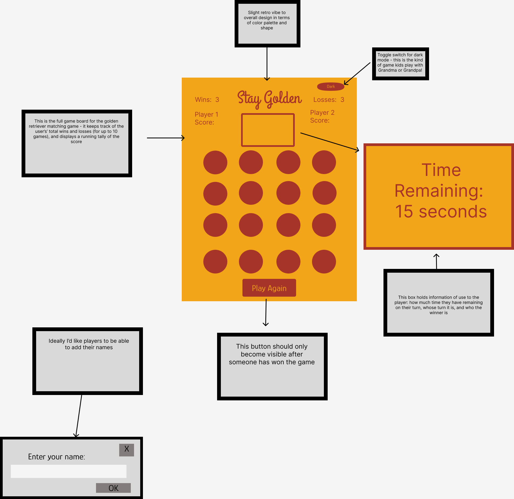
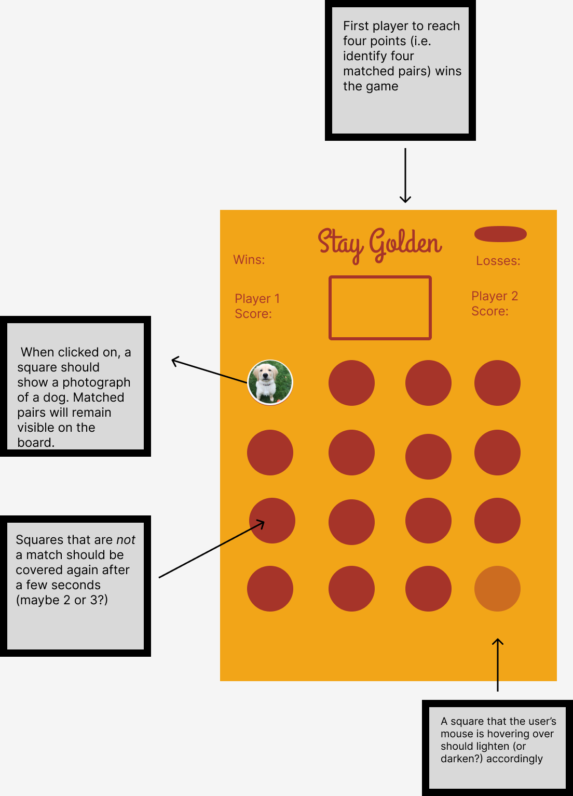
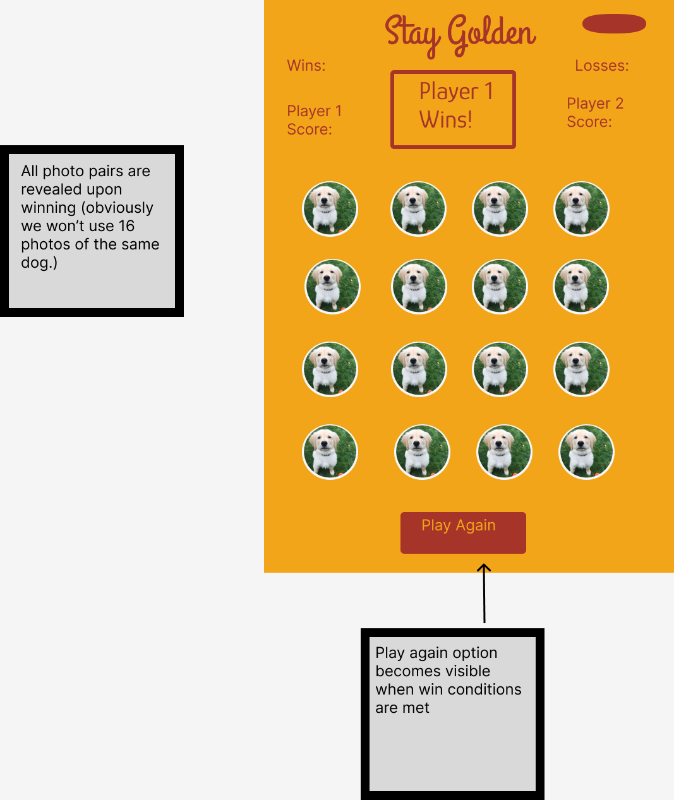

# STAY GOLDEN 

"Stay Golden" was formed from my love of golden retrievers, and fond memories of playing games  at my grandparents' houses when I was growing up. This simple, 2-player matching game asks players to uncover the matching pairs of golden retriever photos. The first player to uncover four matching pairs wins! A timer function ensures that players can't take /too/ long in making their decisions. The game will maintain a tally of players' respective wins for up to 10 games in a row. 

Technologies used: 
-HTML5
-CSS
-Javascript

#### User Stories

- As a user, I want the ability to be able to see my wrong choice for a few seconds after I click it
- I want to see whether it's my turn or the other player's
- I want to see what my current score is
- I want to see what the other player's score is
- I want to see a running tally of wins and losses (for no more than 10 consecutive games) 

#### Icebox Items

 - I'd love to be able to add bark sound effects when a correct match is selected
 - Dark mode toggle on/off
 - Animate game tokens at iinitialization, i.e. having them drop onto the screen

#### Wireframes

